# Домашнее задание к занятию "Система мониторинга Zabbix. Часть 2" - Tarkov Viktor

### Инструкция по выполнению домашнего задания

   1. Сделайте `fork` данного репозитория к себе в Github и переименуйте его по названию или номеру занятия, например, https://github.com/имя-вашего-репозитория/git-hw или  https://github.com/имя-вашего-репозитория/7-1-ansible-hw).
   2. Выполните клонирование данного репозитория к себе на ПК с помощью команды `git clone`.
   3. Выполните домашнее задание и заполните у себя локально этот файл README.md:
      - впишите вверху название занятия и вашу фамилию и имя
      - в каждом задании добавьте решение в требуемом виде (текст/код/скриншоты/ссылка)
      - для корректного добавления скриншотов воспользуйтесь [инструкцией "Как вставить скриншот в шаблон с решением](https://github.com/netology-code/sys-pattern-homework/blob/main/screen-instruction.md)
      - при оформлении используйте возможности языка разметки md (коротко об этом можно посмотреть в [инструкции  по MarkDown](https://github.com/netology-code/sys-pattern-homework/blob/main/md-instruction.md))
   4. После завершения работы над домашним заданием сделайте коммит (`git commit -m "comment"`) и отправьте его на Github (`git push origin`);
   5. Для проверки домашнего задания преподавателем в личном кабинете прикрепите и отправьте ссылку на решение в виде md-файла в вашем Github.
   6. Любые вопросы по выполнению заданий спрашивайте в чате учебной группы и/или в разделе “Вопросы по заданию” в личном кабинете.
   
Желаем успехов в выполнении домашнего задания!
   
### Дополнительные материалы, которые могут быть полезны для выполнения задания

1. [Руководство по оформлению Markdown файлов](https://gist.github.com/Jekins/2bf2d0638163f1294637#Code)

---

### Задание 1

Создайте свой шаблон, в котором будут элементы данных, мониторящие загрузку CPU и RAM хоста.

### Процесс выполнения

   1. Выполняя ДЗ сверяйтесь с процессом отражённым в записи лекции.
   2. В веб-интерфейсе Zabbix Servera в разделе Templates создайте новый шаблон
   3. Создайте Item который будет собирать информацию об загрузке CPU в процентах
   4. Создайте Item который будет собирать информацию об загрузке RAM в процентах

### Требования к результату

   - Прикрепите в файл README.md скриншот страницы шаблона с названием «Задание 1»

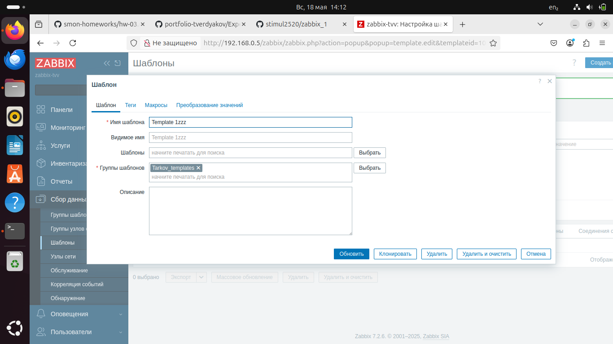
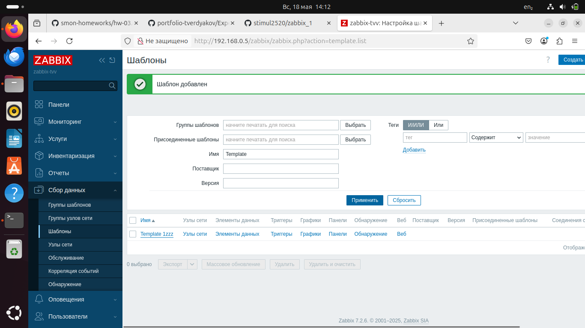
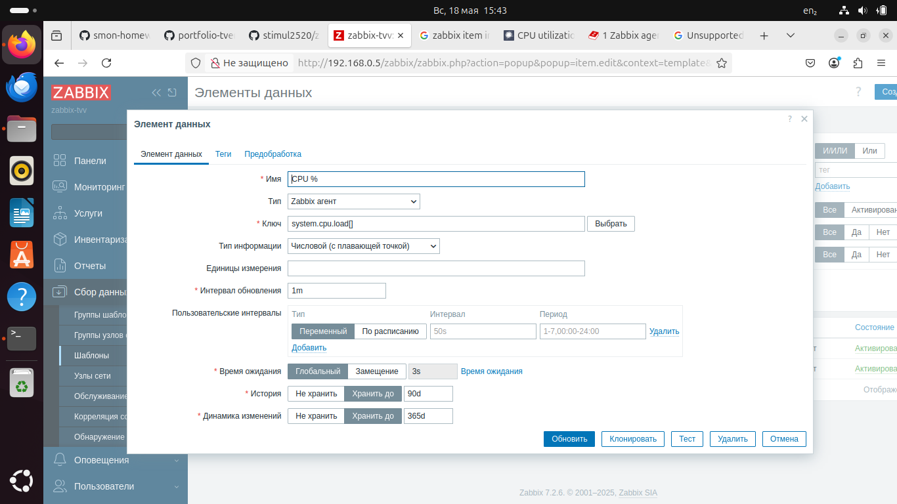
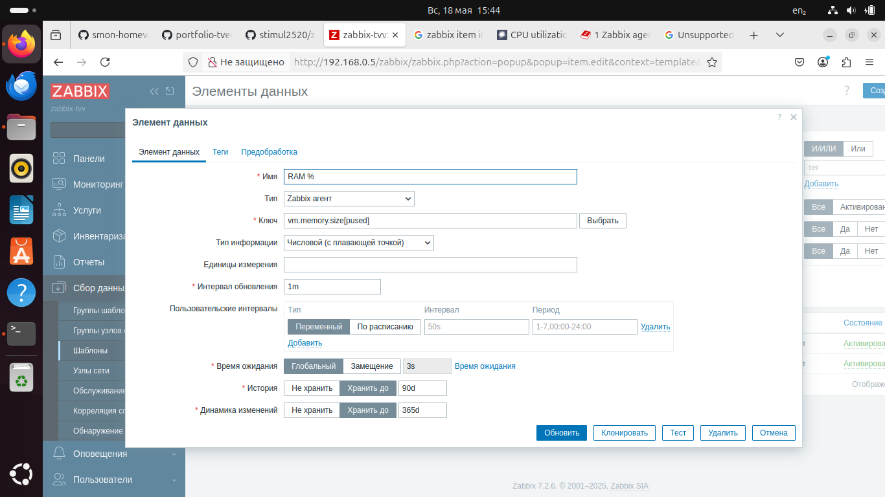
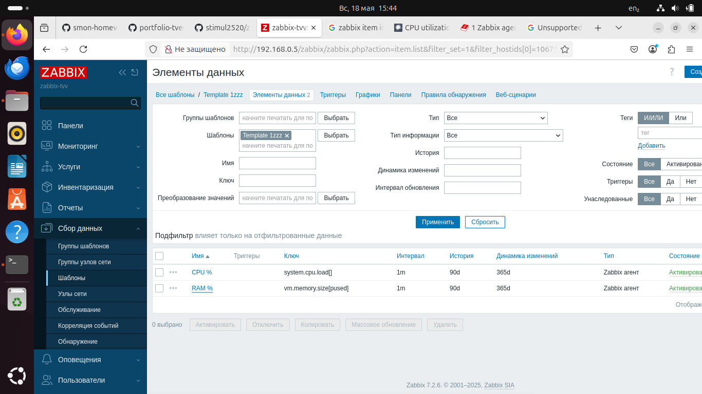

---

### Задание 2

Добавьте в Zabbix два хоста и задайте им имена <фамилия и инициалы-1> и <фамилия и инициалы-2>. Например: ivanovii-1 и ivanovii-2.
Процесс выполнения

   1. Выполняя ДЗ сверяйтесь с процессом отражённым в записи лекции.
   2. Установите Zabbix Agent на 2 виртмашины, одной из них может быть ваш Zabbix Server
   3. Добавьте Zabbix Server в список разрешенных серверов ваших Zabbix Agentов
   4. Добавьте Zabbix Agentов в раздел Configuration > Hosts вашего Zabbix Servera
   5. Прикрепите за каждым хостом шаблон Linux by Zabbix Agent
   6. Проверьте что в разделе Latest Data начали появляться данные с добавленных агентов

### Требования к результату

   - Результат данного задания сдавайте вместе с заданием 3

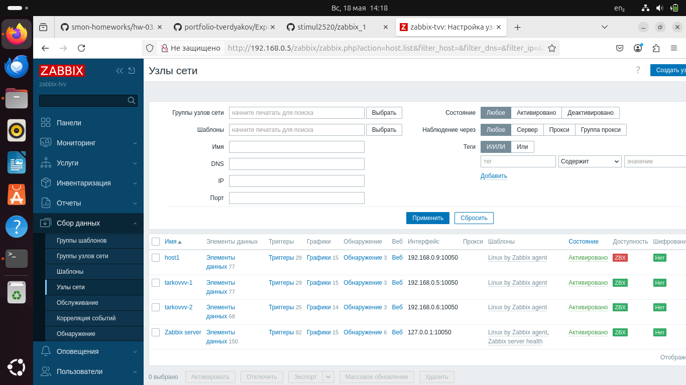
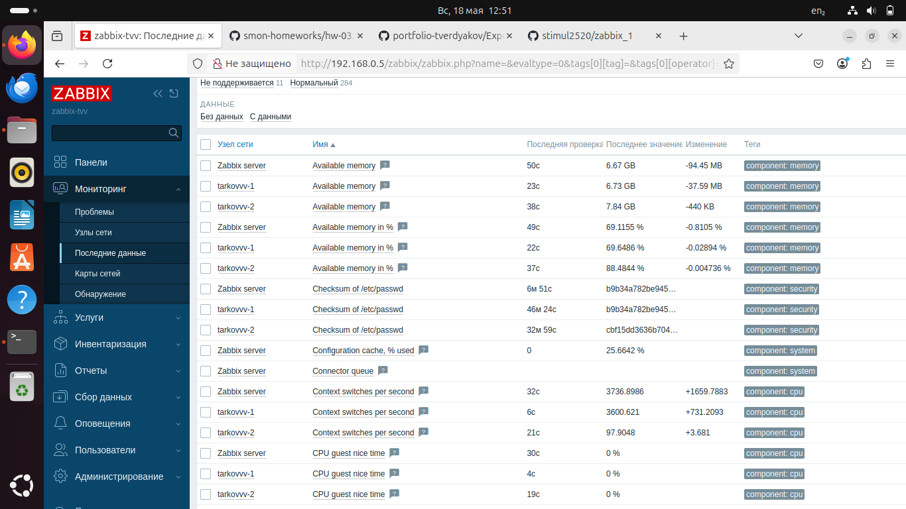

---

### Задание 3

Привяжите созданный шаблон к двум хостам. Также привяжите к обоим хостам шаблон Linux by Zabbix Agent.
Процесс выполнения

   1. Выполняя ДЗ сверяйтесь с процессом отражённым в записи лекции.
   2. Зайдите в настройки каждого хоста и в разделе Templates прикрепите к этому хосту ваш шаблон
   3. Так же к каждому хосту привяжите шаблон Linux by Zabbix Agent
   4. Проверьте что в раздел Latest Data начали поступать необходимые данные из вашего шаблона

### Требования к результату

   - Прикрепите в файл README.md скриншот страницы хостов, где будут видны привязки шаблонов с названиями «Задание 2-3». Хосты должны иметь зелёный статус подключения

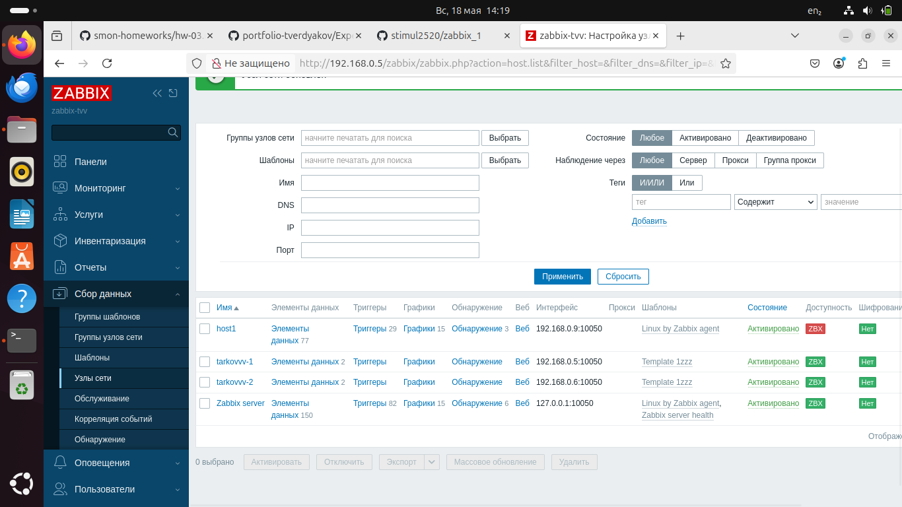
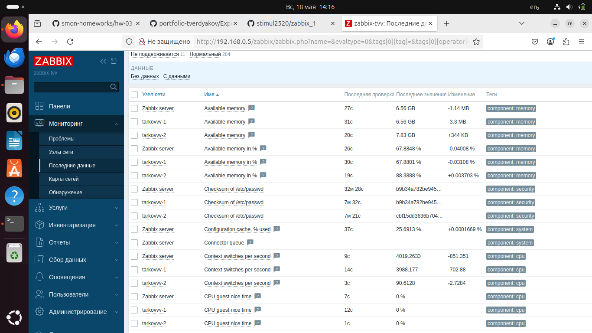
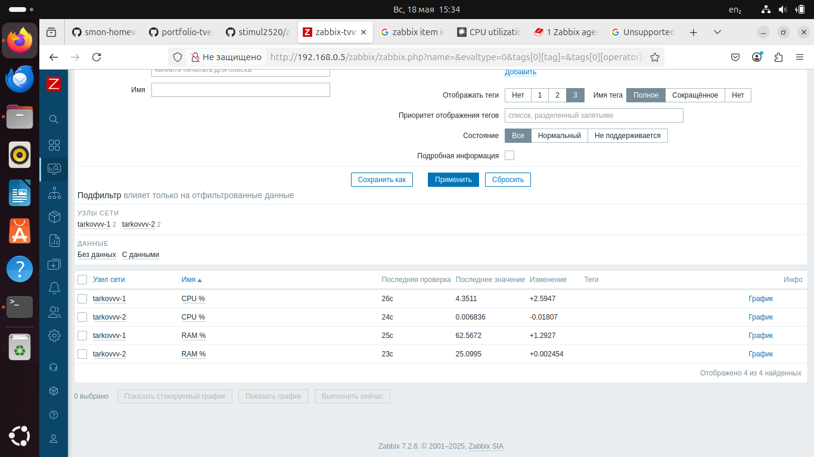

---

### Задание 4

Создайте свой кастомный дашборд.
Процесс выполнения

   1. Выполняя ДЗ сверяйтесь с процессом отражённым в записи лекции.
   2. В разделе Dashboards создайте новый дашборд
   3. Разместите на нём несколько графиков на ваше усмотрение.

### Требования к результату

   - Прикрепите в файл README.md скриншот дашборда с названием «Задание 4»

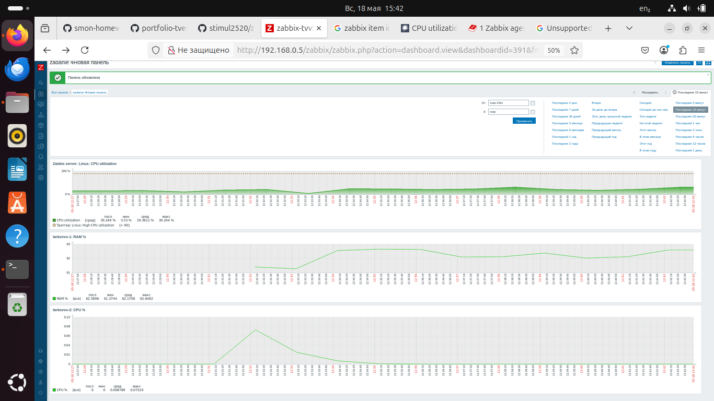

---
